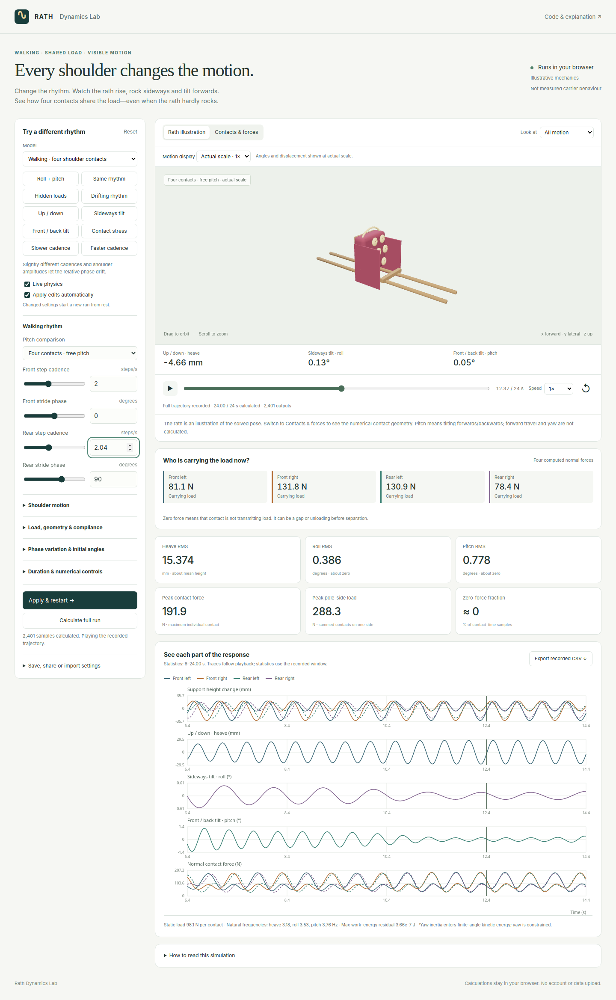
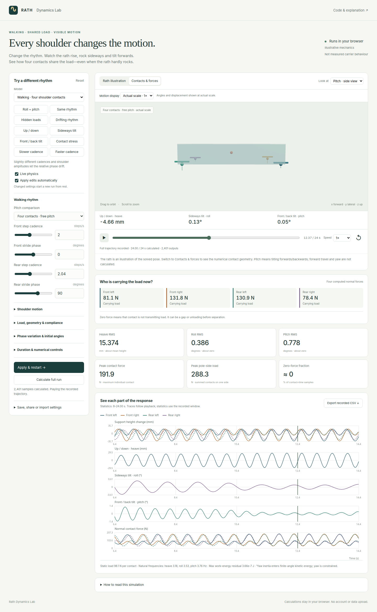

# Rath Dynamics Lab

**Change the walking rhythm. Watch a carried rath bounce, rock sideways and tilt forwards.**

**[Open the interactive simulation →](https://nalin-dhiman.github.io/palanquin-coupled-oscillator-dynamics/)**

A rath is a ceremonial structure carried on poles. This browser simulation represents the carriers with four moving shoulder contacts: front left, front right, rear left and rear right. Change their timing and see how the load moves and how its weight is shared.

Live mode calculates new motion while you watch. It works on a computer or phone, without an account or installation. A run lasts **two minutes by default**, with a maximum of three minutes.



*The walking model with drifting front/rear rhythms. This screenshot shows a completed 24-second comparison, paused for inspection. The default interactive run lasts 120 seconds.*

## Try it in a minute

1. Start with **Roll + pitch**. Watch the rath and the four load readings.
2. Try **Up / down**, **Sideways tilt**, and **Front / back tilt** to see what each kind of support input does. The camera changes for the tilt examples.
3. Change the front or rear **step cadence** or **stride phase**. With automatic application enabled, each edit restarts the simulation from its initial state.
4. Use **Contacts & forces** to see the actual numerical contact geometry. Try **Roll · front view**, **Pitch · side view**, or **Contact layout**.
5. If the movement is hard to see, choose **Magnified · 3×** or **5×**. These views are labelled: the readouts, graphs and exports always retain the actual physical values.
6. Pause to inspect recorded motion. Choose **Calculate full run** to calculate the whole duration immediately, then seek anywhere or export the full CSV.

On a phone, tap **Show all parameters**. Under **Save, share or import settings**, export/import JSON or copy a link that opens the same settings. CSV contains only the part calculated so far unless you finish the run first.

## What can you change?

| Controls | What they do |
| --- | --- |
| Front/rear cadence and stride phase | Change how quickly the carriers step and their relative timing. A stride contains two steps. |
| Vertical bounce and torso tilt | Change the prescribed shoulder heights; torso tilt creates a left/right height difference. |
| Phase variation | Let the rhythm vary smoothly instead of staying perfectly periodic. |
| Mass, spacing, centre of mass and inertia | Change the assumed load and contact geometry. |
| Contact stiffness and damping | Change the compliance at each contact. Contacts can unload or separate. |
| Initial angles, duration and integration step | Explore starting conditions and numerical sensitivity. |
| Camera, speed and magnification | Change the presentation without changing the computed trajectory. |

## Compare four contacts with two supports

The **Pitch comparison** control has three options:

- **Four contacts · free pitch:** the body can move vertically, roll and pitch.
- **Four contacts · locked pitch:** the same four contacts act on a body whose pitch is constrained.
- **Two averaged resultants:** front and rear support inputs are averaged before calculating contact forces; pitch is constrained. Individual shoulder loads are unresolved, so their peak is hidden in the interface.

Try **Hidden loads**. Individual shoulder forces can vary strongly even when there is almost no net rocking. A small tilt does not necessarily mean evenly shared loads.



*The four colours match the load cards and graphs. Bars mark the undeformed support references; they are not solid pads. Upward arrows show computed forces. Zero force means the contact is not transmitting load, either because it has separated or because its force has been clipped during unloading.*

The **Original · two effective supports** model remains available for comparison, including its load-yielding and irregular-input examples. Those supports represent pole sides, not two feet.

## What this simulation can—and cannot—tell you

**Heave** is up/down movement. **Roll** is sideways tilt. **Pitch** is forward/backward tilt. Pitch does not mean travelling forwards or backwards across the ground.

The walking inputs are prescribed shoulder motions. The model does not solve feet, legs, horizontal travel, horizontal contact forces, yaw, pole bending, adaptive gait or human intention. The dimensions, inertia and compliance are assumed, not measurements of ritual carriers or a specific rath. The decorative mesh illustrates the solved pose; its shape does not set the mechanical parameters.

The browser solver is checked against an independent Python implementation for **21 walking comparisons**, as well as the original reference cases. Browser checks verify **120 randomly selected poses**, four contact positions and all **39 mesh component origins**. This establishes implementation consistency, not validation against people. Large forcing with contact opening needs extra care: recontact force spikes can depend on the integration step.

## Run locally

With Node.js 18 or later and Python 3:

```bash
npm ci --ignore-scripts
npm test
npm run build
python3 -m http.server 8080 --directory dist
```

Open [localhost:8080](http://localhost:8080). See the [technical guide](docs/technical-guide.md) for equations, reproducibility, a project-local Python `.venv`, browser testing and publishing. The existing Blender video tools reproduce the original two-support comparison; this update does not relabel that video as a walking simulation.

| Folder | Contents |
| --- | --- |
| `web/` | Interactive app, both solvers and original rath asset. |
| `python/` | Independent reference solvers, tests and existing mesh/video tools. |
| `scripts/` | Build, browser checks, release checks and deployment. |
| `tests/` | Cross-language numerical fixtures and tests. |
| `docs/` | Screenshots, technical guide and verification summary. |

`interactive-main` is the source branch; `interactive-site` holds the published website. The previous `main` branch is preserved. Only code, app assets and documentation are published; manuscripts, PDFs, TeX files and generated videos are excluded.

Original code is available under the [MIT license](LICENSE). Three.js retains its own MIT license.
